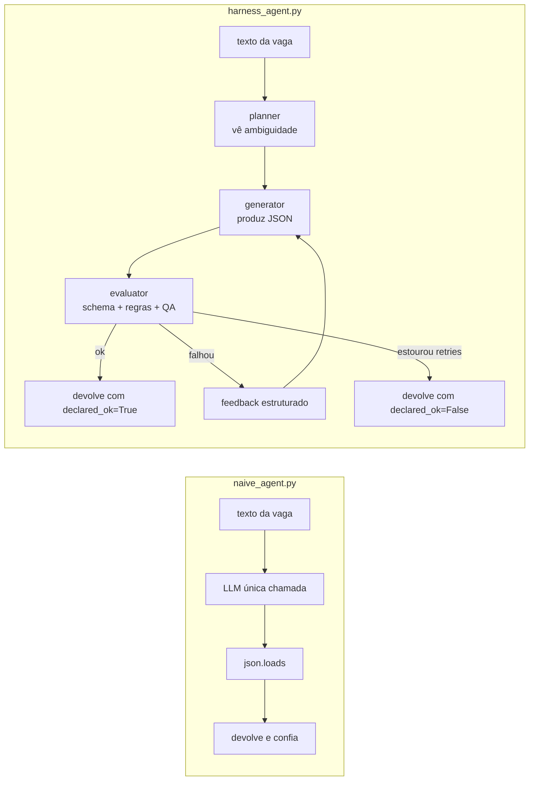

# agent = model + harness


> a maior parte da literatura sobre "por que agente falha em produção" foca no modelo. troca de provider, ajusta prompt, refina chunking. e os números teimam em ficar travados nos 68-70%. esse repo é um experimento minimalista pra mostrar que o gap entre 70% e 95% mora **fora** do modelo: mora no harness.

## por que isso existe

um agente de produção falha de jeitos que prompt engineering não conserta: esquece o que decidiu dois passos atrás, declara sucesso com confiança total antes de entregar resultado quebrado, segue firme num plano que saiu do trilho 12 steps antes.

a equação meio óbvia em retrospecto:

> **agente = modelo + harness**

o modelo é probabilístico. o harness é o esqueleto determinístico em volta da chamada do LLM — quem valida, audita, recupera de erro, e separa quem gera de quem avalia.

três estágios de maturidade da disciplina:

- **prompt engineering** resolve "o modelo me entendeu?"
- **context engineering** resolve "o modelo tem os fatos?"
- **harness engineering** resolve "o modelo sustenta a ação certa por dezenas de steps?"

esse repo compara, na mesma task e com o mesmo modelo, um agente sem harness e um com harness mínimo (planner / generator / evaluator + retry com feedback).

## os dois agentes lado a lado



o ponto-chave: no harness, o **evaluator compara contra o texto original**, não contra o que o generator alegou ter feito. é o que evita o viés otimista clássico de "agente que aprova o próprio trabalho".

## resultados esperados

> ⚠️ números abaixo são **placeholders** — rode no seu ambiente e atualize. a métrica mais importante não é só "taxa de sucesso", é **"falsos sucessos"**: quantas vezes o agente declarou OK e estava errado.

| métrica                                          | naive    | harness  |
|--------------------------------------------------|----------|----------|
| taxa de sucesso real                             | _x/5_    | _y/5_    |
| falsos sucessos (declarou OK, errou)             | _alta_   | _zero_   |
| chamadas ao LLM por task                         | 1        | até 4    |
| custo por task                                   | baixo    | ~3-4x    |
| sabe quando falhou?                              | não      | sim      |

o trade-off é honesto: o harness custa mais por chamada e roda mais devagar. em troca, ele te entrega algo que o naive nunca dá — a capacidade de **saber quando errou** e não sair declarando sucesso.

## o que tem aqui dentro

| arquivo | o que faz |
|---|---|
| [`naive_agent.py`](./naive_agent.py) | baseline: 1 chamada ao LLM, parse otimista, sem evaluator |
| [`harness_agent.py`](./harness_agent.py) | planner + generator + evaluator + retry com feedback estruturado |
| [`tasks.py`](./tasks.py) | 5 descrições de vaga + schema JSON + comparador tolerante |
| [`requirements.txt`](./requirements.txt) | `anthropic`, `jsonschema`, `rich` |
| [`Makefile`](./Makefile) | atalhos: `make install`, `make naive`, `make harness`, `make both` |

## rodando

```bash
# 1. setup
pip install -r requirements.txt
cp .env.example .env  # depois preenche sua ANTHROPIC_API_KEY
export ANTHROPIC_API_KEY=sk-ant-...

# 2. compara os dois
make naive
make harness

# ou os dois em sequência
make both
```

a saída usa `rich` pra mostrar tabela colorida com **o que o agente disse** vs **a realidade**, no final imprime taxa de sucesso real e quantos falsos sucessos rolaram.

## o que aprender lendo o código

cinco padrões concretos que vivem nesse repo, prontos pra copiar pro seu caso:

1. **separação planner / generator / evaluator** ([`harness_agent.py`](./harness_agent.py)) — o planner tem proibição explícita de gerar o output, isso força ambiguidade a virar texto antes de virar commit prematuro a um JSON.
2. **evaluator compara contra a realidade, não contra o claim** ([`evaluator()`](./harness_agent.py)) — o JSON é comparado com o **texto original**, nunca com o que o generator afirmou ter feito. é o que mata o viés otimista.
3. **retry com feedback estruturado** ([`generator()`](./harness_agent.py)) — não é "tenta de novo", é "tentativa anterior falhou por X, corrija". muda completamente a qualidade da segunda tentativa.
4. **validação em camadas** ([`evaluator()`](./harness_agent.py)) — schema determinístico (barato) → regra de negócio (`salario_min <= salario_max`) → QA com LLM (caro). só sobe a camada se a anterior passou.
5. **agente sabe quando falhou** ([`run()`](./harness_agent.py)) — devolve `(data, declared_ok)`. um agente de produção tem que conseguir dizer "não consegui" em vez de sair afirmando sucesso. essa é literalmente a diferença visível no output.

## referências que inspiraram

- **Anthropic** — [Building effective agents](https://www.anthropic.com/research/building-effective-agents), conceito de context reflect e separação generator/evaluator
- **LangChain** — discussões sobre arquitetura de agentes multi-step e patterns de orquestração
- **OpenAI** — guia de práticas pra agentes em produção, foco em validação e recuperação de erro


## licença

[MIT](./LICENSE) — usa, modifica, distribui à vontade.
